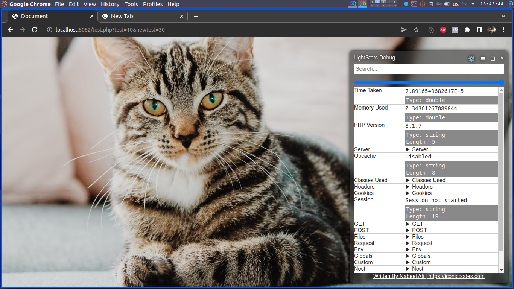
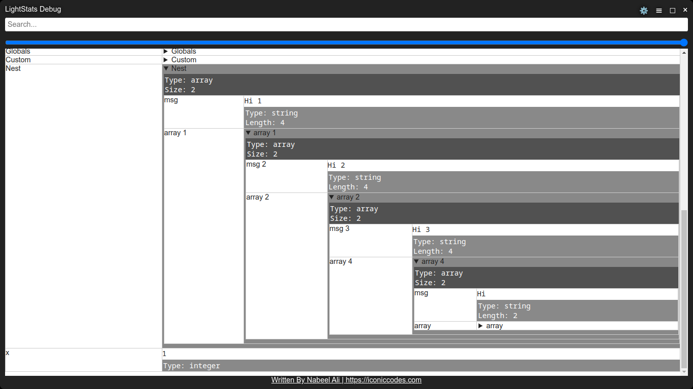
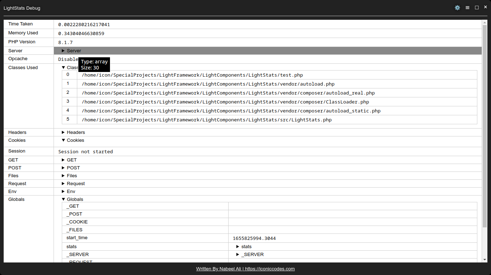

# LightStats

An easy to use request inspector, debugger for PHP with ability to search.




## About Author
[Nabeel Ali](https://iconiccodes.com)

Website: [https://iconiccodes.com](https://iconiccodes.com)

Email: [mail2nabeelali@gmail.com](mailto:mail2nabeelali@gmail.com)


## Features

* Double click to copy the value of cell on clipboard.
* Fullscreen view.
* Size and Type info on hover.
* Toggle Types
* Search
* Change Transparency





## Installtion

```
composer require nabeelalihashmi/LightStats:dev-master
```

## Usage

At start of script, store `microtime` value.
```
$start_time = microtime(true);
```

Create a new instance of `LightStats` class.
```
$stats = new LightStats;
```

At very end, call inspect method/
```
$stats->inspect($start_time);
```

### Inspect own items

LightStats provide static function `ldump`.

```
LightStats::ldump($key, $value);
```

-------------------------

## License

LightStats is released under permissive licese with following conditions:

* It cannot be used to create adult apps.
* It cannot be used to gambling apps.
* It cannot be used to create apps having hate speech.

### MIT License

Copyright 2022 Nabeel Ali | IconicCodes.com

Permission is hereby granted, free of charge, to any person obtaining a copy of this software and associated documentation files (the "Software"), to deal in the Software without restriction, including without limitation the rights to use, copy, modify, merge, publish, distribute, sublicense, and/or sell copies of the Software, and to permit persons to whom the Software is furnished to do so, subject to the following conditions:

The above copyright notice and this permission notice shall be included in all copies or substantial portions of the Software.

THE SOFTWARE IS PROVIDED "AS IS", WITHOUT WARRANTY OF ANY KIND, EXPRESS OR IMPLIED, INCLUDING BUT NOT LIMITED TO THE WARRANTIES OF MERCHANTABILITY, FITNESS FOR A PARTICULAR PURPOSE AND NONINFRINGEMENT. IN NO EVENT SHALL THE AUTHORS OR COPYRIGHT HOLDERS BE LIABLE FOR ANY CLAIM, DAMAGES OR OTHER LIABILITY, WHETHER IN AN ACTION OF CONTRACT, TORT OR OTHERWISE, ARISING FROM, OUT OF OR IN CONNECTION WITH THE SOFTWARE OR THE USE OR OTHER DEALINGS IN THE SOFTWARE.

